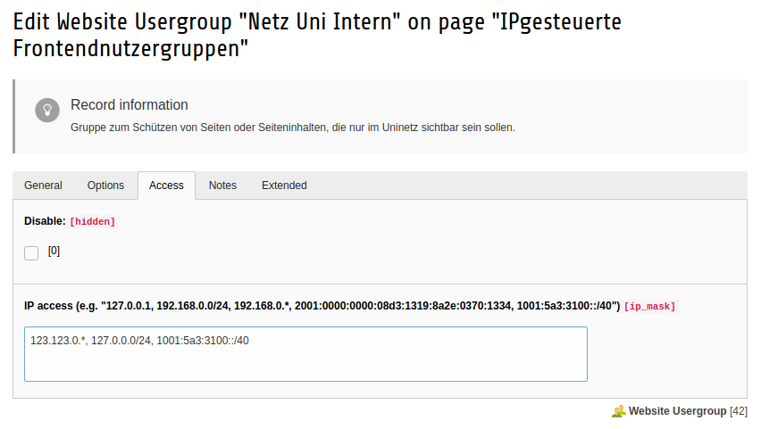
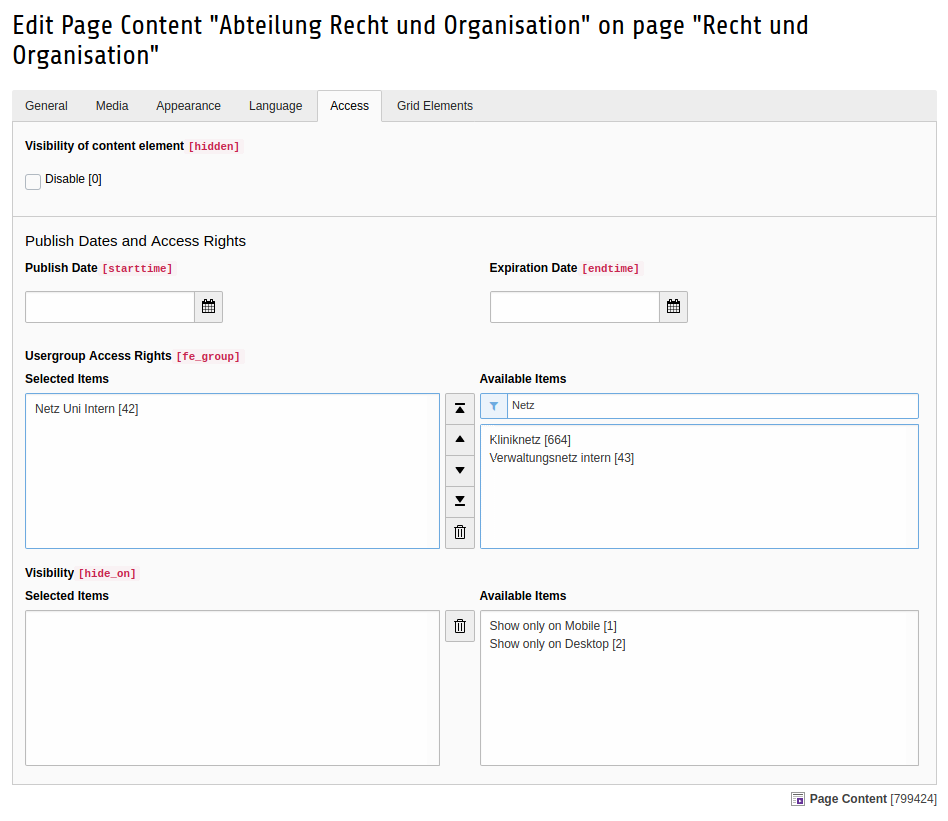
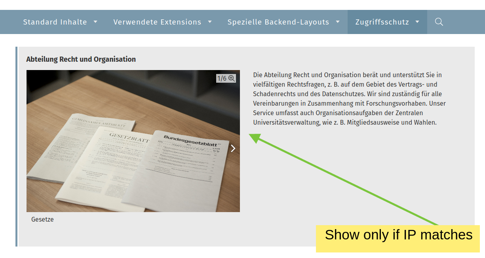

# TYPO3 extension in2frontendauthentication

## Introduction

TYPO3 extension to simulate fe-login for a group if IP-address (IPv4 and IPv6) fits.
You can define multiple IPs and ranges per group in backend.

## Introduction







**Note:** This allows you to show/hide contentelements, pages and other records to a specific usergroup.
But "showAtAnyLogin" or "hideAtAnyLogin" is not supported.

## Requirements and installation

```
composer require in2code/in2frontendauthentication
```

This extension **requires an installation via composer** because of the usage of library s1lentium/iptools.

## Example for IP and IP-Range definitions in fe_groups.ip_mask

```
127.0.0.1
127.0.0.0/12
127.0.0.*
1001:5a3:3100:0000:0000:0000:0000:0000
1001:5a3:3100:::::
1001:5a3:3100::/40
1001:5a3:3100:0000:*:*:*:*
```

You can use single ip addresses or ranges with subnetmask definition (e.g. `/8`). In addition it is possible to use
`*` as wildcards.
Simply define more ip addresses or ranges and split them with comma.

## Supported TYPO3- and PHP-Versions

* TYPO3 11.5

* PHP 7.4

## Supported Extension

* fal_securedownload in version 4.0 or newer
* staticfilecache (see notes below)

## Static File Cache

The extension staticfilecache sets a cookie to identify, whether a user is logged in and the static file cache may not
be used. It hooks into the normal authentication process, when the user is initialized. With
EXT:in2frontendauthentication there are no specific frontend users, so it must be set here too.

This feature can be enabled in the extension settings in the extension manager.

## Changelog

| Version | Date       | State      | Description                                                                                     |
|---------|------------| ---------- |-------------------------------------------------------------------------------------------------|
| 7.0.0   | 2022-06-01 | Task       | Update for TYPO3 11.5                                                                           |
| 6.0.0   | 2020-10-21 | Task       | Update for TYPO3 9.5 or 10.4                                                                    |
| 5.0.2   | 2020-03-11 | Bugfix     | Update dependencies to typo3/cms-core to enable installation in TYPO3 9                         |
| 5.0.1   | 2020-03-02 | Bugfix     | Prevent exception in ExtensionConfigurationUtility                                              |
| 5.0.0   | 2020-03-02 | Feature    | Support subnetmask for IPv4 and IPv6 now in definitions, update requirements                    |
| 4.0.0   | 2020-01-22 | Feature    | Add support for IP V6. This is the first Release with the composer requirement "mlocati/ip-lib" |
| 3.0.0   | 2020-01-20 | Feature    | Support TYPO3 V9. This is the last release without composer requirement                         |
| 2.0.3   | 2019-10-07 | Bugfix     | Fix another regression for the latest feature                                                   |
| 2.0.2   | 2019-10-07 | Bugfix     | Change namespace to CookieService class                                                         |
| 2.0.1   | 2019-10-07 | Bugfix     | Fix exception when instantiating CookieService class of staticfilecache                         |
| 2.0.0   | 2019-09-30 | Feature    | Respect staticfilecache cookies                                                                 |
| 1.1.1   | 2017-07-18 | Bugfix     | Signal update from fal_securedownload                                                           |
| 1.1.0   | 2017-07-10 | Feature    | Support EXT:fal_securedownload >= version 2.0.0                                                 |
| 1.0.2   | 2016-08-03 | Bugfix     | Allow multiple usergroups                                                                       |
| 1.0.1   | 2016-06-23 | Bugfix     | Small fix in german locallang                                                                   |
| 1.0.0   | 2016-06-10 | Task       | Initial release                                                                                 |
